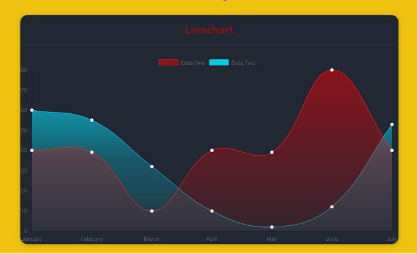

# awesome-charts-vue

> A Vue.js project



Chart data at https://api.myjson.com/bins/8sqwr

## Build Setup

``` bash
# install dependencies
npm install

# serve with hot reload at localhost:8080
npm run dev
```

